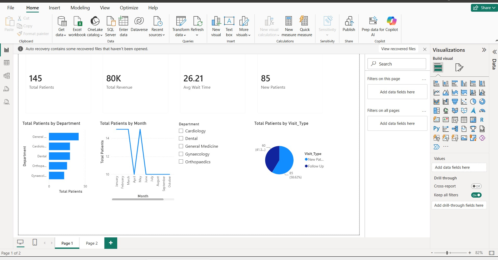
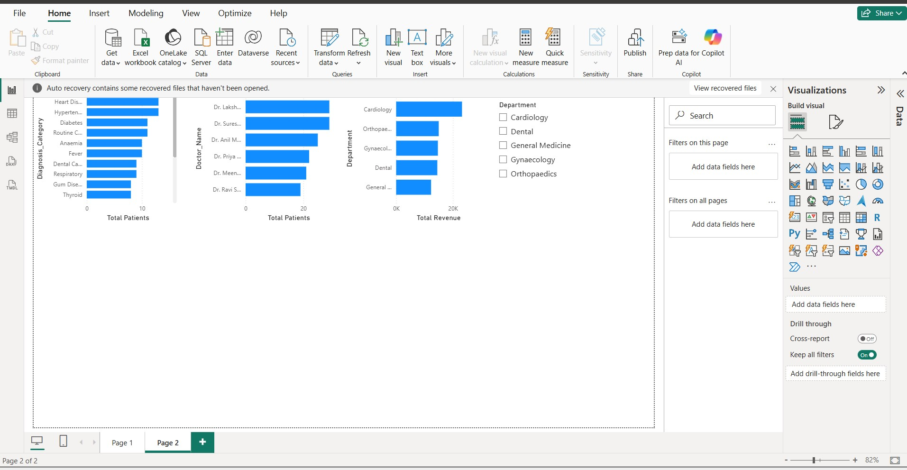

# hospital-opd-dashboard
Hospital OPD analysis dashboard built with Power BI — patient visits, department wise analysis
# Hospital OPD Dashboard

## Problem Statement
Hospitals need to monitor outpatient department performance to improve 
patient flow and resource allocation.

## Dataset
- Hospital OPD records
- Patient visits, department wise data

## Key Features
- Patient visit trends by department
- Peak hours and busy days analysis
- Department wise patient load
- Doctor performance metrics

## Tools Used
- Power BI Desktop
- DAX measures
- Data modeling

## Dashboard Preview

